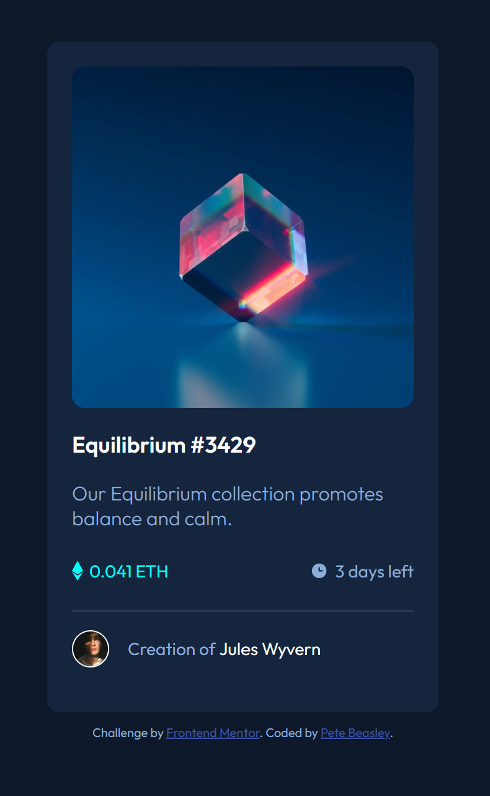

# Frontend Mentor - NFT Product Preview Card Component Challenge

This is a solution to the [NFT product preview card component challenge on Frontend Mentor](https://www.frontendmentor.io/challenges/nft-preview-card-component-SbdUL_w0U). Frontend Mentor challenges help you improve your coding skills by building realistic projects. 

## Table of contents

- [Screenshot](#screenshot)
- [Links](#links)
- [Built with](#built-with)
- [Author](#author)

### Screenshot

### Links

- Solution URL: https://www.frontendmentor.io/solutions/nft-product-preview-card-challenge-using-html5-and-css3-LXv47jBXxf
- Live Site URL: https://pbeasley82-nftproductpreview.netlify.app

### Built with

- Semantic HTML5 markup
- CSS custom properties
- Flexbox

## Author

- Website - TBA
- Frontend Mentor - https://www.frontendmentor.io/profile/pbeasley82
- Twitter - https://www.twitter.com/petebeasley5
